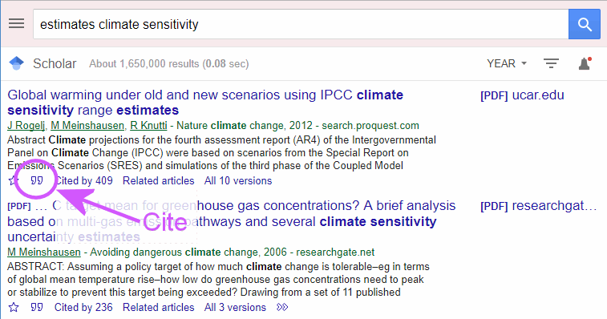
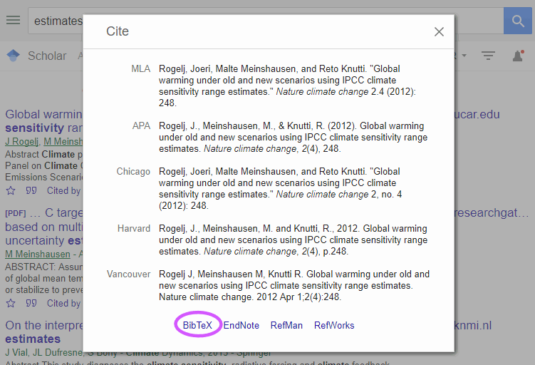

```{r setup, include=FALSE}
knitr::opts_chunk$set(echo = TRUE)
```
# Introduction

RMarkdown has the ability to automatically format bibliographic information and
manage citations. Using this is a little complicated because you need to have
file with your bibliographic information entered in a certain format. Fortunately,
RMarkdown can work with a wide variety of file formats, including those produced
by many common software packages, such as EndNote, Zotero, and Mendeley.
You can find further documentation about bibliographies and citations
at <http://rmarkdown.rstudio.com/authoring_bibliographies_and_citations.html>

# Bibliography Files

RMarkdown reads bibliography entries from an external bibliography file.
To specify the bibloography file, you would 
just add a line to the header of your RMarkdown document: for instance,

```
---
title: "My Lab Report"
subtitle: "EES 3310: Global Climate Change"
author: "Jonathan Gilligan"
date: "Sept. 27, 2018"
bibliography: "my_bibliography.bib"
---
```

RMarkdown can figure out the kind of bibliography file it is from the file extension
(`.bib`, etc.). I have provided an example BibTeX file, `lab_05.bib` that
has examples of entries.

For the examples here, I will work with a format called BibTeX because most
common software packages can export bibliographies in BibTeX format, and 
Google Scholar can also provide citations in BibTeX format that you can copy 
and past from a browser. BibTeX files are plain text and you can edit them in
RStudio.[^1]

[^1]: If you will use BibTeX files often, I recommend a free tool
called JabRef, which lets you edit the information in a BibTeX file
in a graphical interface without having to worry about the details of the 
BibTeX format. You can get JabRef from <http://www.jabref.org/>.
It runs on Windows, MacOS, and Linux.

If you prefer, you can also use bibliographic software, such as 
Zotero,[^2] Mendeley, or EndNote, and export your bibliography in
RIS format (as a `.ris` file), BibTeX format (as a `.bib` file),
or BibLaTeX format (as a `.biblatex` file).
RMarkdown claims to support the following file types as well, but I 
have not tried them, so I would not be able to provide much help if you
try them and run into trouble.

[^2]: I recommend Zotero, which is a free, easy to use, and very powerful
bibliography tool that supports Windows, MacOS, and Linux, and has
add-ins that integrate very nicely with most browsers (Chrome, Firefox, Safari, 
and Opera) and also has a good add-in to let you use it in 
Microsoft Word. Zotero has hundreds of bibliography styles for different 
uses, including standard ones, such as Chicago, APA, and MLS.
You can get Zotero from <https://zotero.org>. One reason I like Zotero 
enormously is that the web browser add-in creates an icon in the browser's 
toolbar that recognizes when you are reading an article in a scholarly journal,
a newspaper, a magazine, a blog, etc., and you can just click on the icon to import 
whatever you're reading in your browser into your bibliography database.
You can also sign up for a free account on <https://www.zotero.org/user/register>
that will let you back up your bibliography database to the cloud, synchronize
your bibliographies across multiple computers, and share bibliographies with 
other people.

\clearpage

| Format | File extension |
|:-------|:--------------|
| EndNote | `.enl` |
| EndNote XML | `.xml` |
| RIS | `.ris` |
| BibTeX | `.bib` |
| ISI | `.wos` |
| MEDLINE | `.medline` |
| MODS | `.mods` |
| Copac | `.copac` |
| JSON citeproc | `.json` |

You can export files in many of these formats (especially RIS and BibTeX) from
most bibliographic software packages, such as EndNote, Mendeley, and Zotero.

# Citations

In your document, you can cite books, articles, etc. by the identifiers, or 
_keys_, that appear in the database.[^3] 
If you open the bibliography file in RStudio, you will see that all references
begin with a reference type, starting with `@` (e.g., `@book` for a book,
`@article` for an article in a journal, etc.) and then all the data for the 
reference is contained between a pair of braces `{...}`.
The first thing after the opening brace will be the citation key,
followed by a comma:
```
@book{archer.forecast.2011,
  title = {Global Warming: Understanding the Forecast},
  author = {Archer, David},
  publisher = {Wiley},
  address = {Hoboken, NJ},
  year = {2011},
  edition = {2nd}
}

@article{rogelj2013probabilistic,
  title={Probabilistic cost estimates for climate change mitigation},
  author={Rogelj, Joeri and McCollum, David L and Reisinger, Andy and 
          Meinshausen, Malte and Riahi, Keywan},
  journal={Nature},
  volume={493},
  pages={79--83},
  year={2013},
}
```
The citation keys for these two references are 
`archer.forecast.2011` and `rogelj2013probabilistic`.

[^3]: In BibTeX files, the identifiers can
be any sequence of letters, numbers, and any of the following punctuation:
'`_`', '`.`', '`:`', and '`;`'.


I can insert citations in an RMarkdown document by putting them inside
square brackets (`[...]`) and putting an `@` in front of the citation key:
`[@archer.forecast.2011]` will become [@archer.forecast.2011].
I can cite a specific page with 
`[@archer.forecast.2011, p. 143]`, which becomes [@archer.forecast.2011, p. 143].
I can also add some preceding text: 

```
[See, e.g., @archer.forecast.2011, pp. 75--78]
```
becomes
[See, e.g., @archer.forecast.2011, pp. 75--78].

I can cite multiple authors: 
```
[@archer.forecast.2011, @nordhaus.casino.2013, and @pielke.climate.fix.2010].
```
becomes

> [@archer.forecast.2011, @nordhaus.casino.2013, and @pielke.climate.fix.2010].

If I want to omit the name of the author (for instance, if I have named him or her
earlier in the text), I can put a minus sign in front of the `@`:
```
Archer describes the water-vapor feedback [-@archer.forecast.2011].
```
becomes

> Archer describes the water-vapor feedback [-@archer.forecast.2011].
    
I can also put citations in-line by omitting the square brackets:

```
@jaeger.adams.fallacy.2008 argue that focusing only on the economic 
impacts of climate change is misleading.
```
becomes

> @jaeger.adams.fallacy.2008 argue that focusing only on the economic 
> impacts of climate change is misleading.

and I can also add page numbers or other text to follow the year in the citation
by putting them in square brackets after an in-text citation:
```
@rogelj2013probabilistic [Fig. 2, p. 81] show that if political inaction
causes even modest delays in reducing carbon emissions, it can dramatically 
increase the cost of mitigating climate change.
```
becomes

> @rogelj2013probabilistic [Fig. 2, p. 81] show that if political inaction
> causes even modest delays in reducing carbon emissions, it can dramatically 
> increase the cost of mitigating climate change.

# The Bibliography

RMarkdown will insert a formatted bibliography at the end of your document.
It will not automatically put a section heading, so you probably want to put
a section heading called "Bibliography" or "Works Cited" to set this off
from your text. 

At the bottom of this `.Rmd` file, I have inserted the line
```
# References
```

## Adding entries to the bibliography file

If you want to add new references to the bibliography file, you can 
open `lab_05.bib` in RStudio and edit it by hand, but that may be difficult
and confusing, so I would recommend one of three options:

* From Google Scholar, you can export a BibTeX entry: 

    1. Open `lab_05.bib` in RStudio and then open a web browser, go to 
       <https://scholar.google.com> and search for your reference.

    2. When you find the reference you want in Google Scholar, and click on the 
       "Cite" button, as shown below:

        \

    3. Click on "BibTeX" at the bottom of the citation page, as shown below:

        \

    4. You will see something like this:

        ```
         @article{rogelj2012global,
          title={Global warming under old and new scenarios using IPCC climate 
                 sensitivity range estimates},
          author={Rogelj, Joeri and Meinshausen, Malte and Knutti, Reto},
          journal={Nature climate change},
          volume={2},
          number={4},
          pages={248},
          year={2012},
          publisher={Nature Publishing Group}
        }
        ```
        
         Copy the entry and paste it into `lab_05.bib` in RStudio.
         
         In this entry, `rogelj2012global` is the key you would use
         for citing and the other fields are pretty much self-explanatory.

* If you have a bibliographic program like Zotero, Mendeley, or EndNote, 
  export the references you want as BibTeX files.
   
     For instance, in Zotero,[^5] highlight the references, right click, and from 
     the context menu choose "Export Items..."; then select "BibTeX" format, 
     click "OK" and save the exported items to a file.)
    
     Next, open the file you just exported and `lab_05.bib` in RStudio and
     copy and past the references from the exported file into `lab_05.bib`.
     
* If you have JabRef[^6] installed on your computer, you open `lab_05.bib`,
  manually create a new bibliographic entry and fill in the relevant data.
  
[^5]: Zotero is free software that runs on Windows, MacOS, and Linux, and you
can download it from <https://zotero.org>

[^6]: JabRef is free software that runs on Windows, MacOS, and Linux and you can
download it from <https://jabref.org>.


# References

